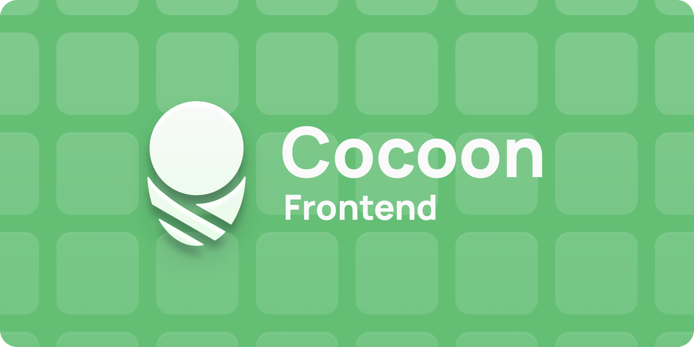

# Cocoon

**A Modern Emulation Frontend for Android**

*An emulation frontend inspired by the 3DS UI built for single and dual screen Android devices*

[Features](#features) • [Installation](#installation) • [Setup](#setup)

---

## Features

### Multi-Platform Game Library
- **Universal Emulator Support**: Works with any Android emulator (RetroArch, Dolphin, PPSSPP, and more)
- **100+ Platform Support**: Nintendo (NES, SNES, N64, GameCube, Wii, Switch), PlayStation (1-5), Sega (Genesis, Saturn, Dreamcast), Xbox, Arcade, and more
- **Smart Organization**: Automatically categorizes games by platform with intelligent folder detection

### Beautiful UI & Visuals
- **Rich Artwork**: Automatically fetches icons, logos, and hero images from SteamGridDB
- **Smooth Animations**: Fluid transitions and responsive interactions
- **Adaptive game grid with zoom feature**: just like the 3DS!

### Automatic Metadata Scraping
- **Hash-Based ROM Identification**: Uses CRC32, MD5, and SHA1 for accurate game matching
- **ScreenScraper.fr Integration**: 
  - Comprehensive game metadata (title, description, release date, genres)
  - Developer and publisher information
  - User ratings and classifications
  - Multiple regions support
  - Works with guest API (no account required) or authenticated for faster access
- **SteamGridDB Artwork**: High-quality game artwork in multiple styles
- **Batch Processing**: Scrape entire libraries with progress tracking

### Advanced Display Features

<video src="screen_swap_compressed.mp4" width="320" height="240" controls></video>

- **External Display Support**: Display game information and launch games to an external display
- **Display Management**: 
  - Automatic external display detection
  - Seamless game launching to secondary displays
  - External display overlay with game info
- **Live screen-swapping**: Seamlessly switch between screen roles with a button

### Powerful Configuration
- **Per-Platform Settings**: 
  - Custom emulator app/player selection
  - Multiple ROM folder paths per platform
- **Appearance Customization**:
  - Customize library layout
  - Icon image size adjustment

---

## Installation

### Download
1. Download the latest APK from [Releases](https://github.com/inssekt/Cocoon/releases)
2. Enable "Install from Unknown Sources" in Android settings
3. Install the APK

---

## 🎯 Setup

### First-Time Setup Wizard

---

## Setups (Optional but recommended):
   - **SteamGridDB**: Get artwork for your games
     - Visit [steamgriddb.com/profile/preferences/api](https://www.steamgriddb.com/profile/preferences/api)
     - Create an API key
   - **ScreenScraper.fr**: Get game metadata
     - Register at [screenscraper.fr](https://www.screenscraper.fr/)
     - Optional - works with guest API without login

2. **Organization Mode**:
   - **Smart Folders** (Recommended): Cocoon auto-detects platforms and creates smart folders from which you can create homescreen shortcuts
   - **Manual Mode**: Cocoon puts all detected ROMs onto your homescreen to be organised yourself (Smart Folders can still be manually created)

3. **ROM Folders**:
   - Browse to your ROM root folder
   - Cocoon will scan for games automatically with optional subfolder scanning

---

The complete platform list is available in [platforms.json](platforms.json).

---

## Support

For bug reports and feature requests, please use [GitHub Issues](https://github.com/inssekt/Cocoon/issues) or [Join our Discord](https://discord.gg/ytWHjRuKdS).

---

## Acknowledgments

- **ScreenScraper.fr**: Game metadata and ROM information
- **SteamGridDB**: High-quality game artwork
- **Daijisho**: A great curated collection of platforms & players that we use as a base
